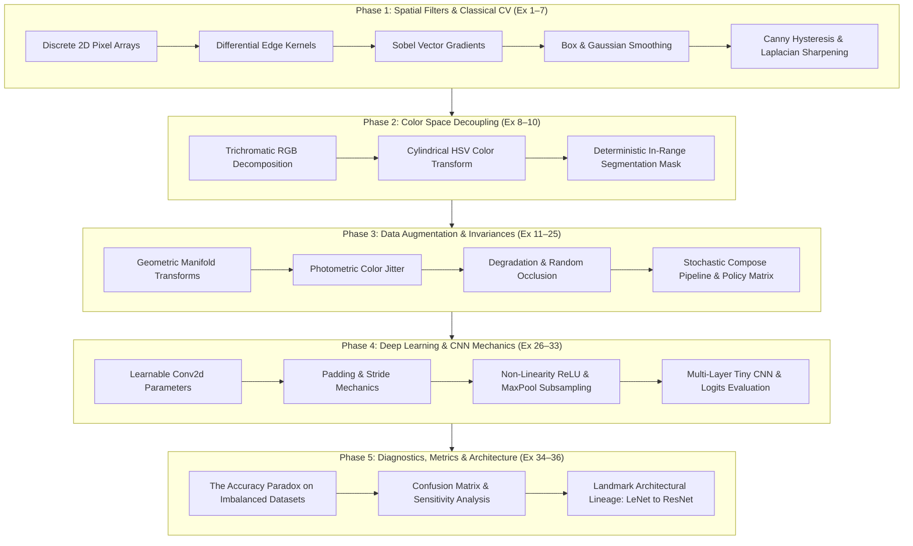

<div align="center">

# 👁️ Practical Computer Vision & Deep Learning Foundations
### *From Discrete 2D Spatial Convolutions to Deep Convolutional Architectures*

[](https://www.python.org/)
[](https://pytorch.org/)
[](https://pytorch.org/vision/)
[](https://opencv.org/)
[](https://jupyter.org/)
[](LICENSE)

*An end-to-end pedagogical and practical implementation of classical image processing, deterministic color segmentation, stochastic data augmentations, and deep convolutional neural networks.*

---

</div>

## 📌 Executive Overview

This repository houses a comprehensive, first-principles implementation of **36 practical computer vision exercises** structured across five distinct developmental phases. Designed with industrial rigor and mathematical discipline, the project bridges the conceptual gap between **classical deterministic signal processing** and **modern statistical deep learning**.

### Pedagogical Framework
Every exercise is executed according to the continuous feedback loop:
$$\mathbf{Data} \longrightarrow \mathbf{Program} \longrightarrow \mathbf{Observation} \longrightarrow \mathbf{What\ We\ Learned} \longrightarrow \mathbf{Practical\ Use} \longrightarrow \mathbf{Failure\ Modes} \longrightarrow \mathbf{Next\ Question}$$

---

## 🏗️ Architectural Blueprint



---

## 🔬 Detailed Phase Breakdown

### Phase 1: Spatial Filtering & Classical Edge Detection (Exercises 1 – 7)
*Focus: Discrete convolution operators, finite-difference spatial approximations, low-pass smoothing, and high-pass sharpening.*

- **Exercise 1: Inspect Image as Numbers** — Discrete 2D representation $I \in \mathbb{R}^{H \times W}$, 8-bit dynamic range quantization ($[0, 255]$), sub-matrix slicing.
- **Exercise 2: Vertical Edge Detector** — Finite-difference spatial kernel convolving horizontal brightness gradients:
  $$K_v = \begin{bmatrix} -1 & 0 & 1 \\ -1 & 0 & 1 \\ -1 & 0 & 1 \end{bmatrix}$$
- **Exercise 3: Horizontal Edge Detector** — Transposed differential operator for row-wise transitions:
  $$K_h = \begin{bmatrix} -1 & -1 & -1 \\ 0 & 0 & 0 \\ 1 & 1 & 1 \end{bmatrix}$$
- **Exercise 4: Sobel Operator & Total Gradient Magnitude** — Directional derivatives with orthogonal smoothing; Euclidean gradient magnitude:
  $$G = \sqrt{G_x^2 + G_y^2}, \quad \theta = \arctan\left(\frac{G_y}{G_x}\right)$$
- **Exercise 5: Averaging Box Filter** — Spatial low-pass filtering enforcing energy conservation ($\sum K_{i,j} = 1$) to attenuate high-frequency shot noise.
- **Exercise 6: Multi-Stage Canny Edge Detection** — Gaussian pre-smoothing, gradient vector computation, Non-Maximum Suppression (NMS), and dual-threshold hysteresis ($\tau_{low}=100, \tau_{high}=200$).
- **Exercise 7: Laplacian Image Sharpening** — High-pass second-derivative emphasis:
  $$K_{sharp} = \begin{bmatrix} 0 & -1 & 0 \\ -1 & 5 & -1 \\ 0 & -1 & 0 \end{bmatrix} = \text{Identity} + \text{Laplacian}$$

---

### Phase 2: Color Space Decoupling & Deterministic Vision (Exercises 8 – 10)
*Focus: Color representation geometry, chromaticity vs luminance separation, and bounded mask thresholding.*

- **Exercise 8: Trichromatic RGB Channel Decomposition** — 3D tensor arrays $(H, W, 3)$, additive color synthesis, channel isolation.
- **Exercise 9: RGB to HSV Cylindrical Projection** — Decoupling chromaticity from illumination ($H \in [0, 179]$, $S \in [0, 255]$, $V \in [0, 255]$) for robust illumination invariance.
- **Exercise 10: In-Range Color Thresholding** — Deterministic bounding box segmentation ($[35, 50, 50] \le \text{HSV} \le [85, 255, 255]$) for real-time target extraction without machine learning overhead.

---

### Phase 3: Stochastic Data Augmentations (Exercises 11 – 25)
*Focus: Synthesizing realistic domain transformations, regularizing decision boundaries, and preventing semantic label corruption.*

| Category | Transforms Implemented | Engineering Justification |
| :--- | :--- | :--- |
| **Geometric** | Horizontal/Vertical Flip, Rotation ($20^\circ$), Translation, Scale, Random Resized Crop ($224\times224$) | Enforces spatial equivariance and distance/viewpoint invariance. |
| **Photometric** | Brightness, Contrast, Saturation, Hue Jitter (`ColorJitter`) | Simulates sensor dynamic range, varying daylight, and exposure changes. |
| **Degradation / Occlusion** | Gaussian Blur ($\sigma \in [0.1, 3]$), Perspective Tilt, Random Erasing | Prevents single-feature over-reliance and simulates lens defocus / partial occlusion. |
| **Pipeline & Policy** | Composed stochastic pipeline (`T.Compose`), Task-specific Policy Matrix | Formal selection of valid domain invariances vs. label-destructive transformations. |

---

### Phase 4: Deep Learning & CNN Mechanics (Exercises 26 – 33)
*Focus: PyTorch tensor mechanics, visual feature maps on MNIST handwritten digits, parameter geometries, dimensionality equations, and hierarchical forward passes.*

- **Exercise 26: Parameterized Convolutional Layer & Filter Visualization** — Weight geometry analysis ($C_{out} \times C_{in} \times K_h \times K_w = [8, 1, 3, 3]$) and heatmap rendering of initialized learnable spatial kernels.
- **Exercise 27: Spatial Forward Pass with Real MNIST Data** — Convolution transformation without padding yielding dimensionality reduction:
  $$O = \left\lfloor \frac{W - K + 2P}{S} \right\rfloor + 1 \implies \left\lfloor \frac{28 - 3 + 0}{1} \right\rfloor + 1 = 26$$
  Visualizing the raw input digit ($28\times 28$) alongside all 8 output activation feature maps ($26\times 26$).
- **Exercise 28: Zero-Padding** — Border preservation ($P=1 \implies 28 \times 28$) across deep stacks with side-by-side feature map inspection.
- **Exercise 29: Strided Convolutions** — Spatial subsampling ($S=2, P=1 \implies 14 \times 14$) providing computational efficiency and spatial dimension reduction.
- **Exercise 30: Rectified Linear Activation (ReLU)** — Element-wise non-linearity $f(x) = \max(0, x)$ clamping negative responses to 0, producing sparse feature representations.
- **Exercise 31: Max Pooling** — Translation-invariant local maximum extraction and spatial downsampling ($28\times28 \rightarrow 14\times14$).
- **Exercise 32: Multi-Layer Tiny CNN Architecture** — Hierarchical feature extractor stack:
  $$\text{Input}(1\times28\times28) \xrightarrow{\text{Conv+ReLU}} 16\times28\times28 \xrightarrow{\text{MaxPool}} 16\times14\times14 \xrightarrow{\text{Conv+ReLU}} 32\times14\times14 \xrightarrow{\text{MaxPool}} 32\times7\times7 \xrightarrow{\text{Linear}} 10$$
  Visualizing multi-stage layer activations from low-level edges to higher-level abstractions.
- **Exercise 33: Classification Logits & Softmax Probabilities** — Mapping unnormalized energy logits to categorical probability distributions, visualizing predicted digit confidence against ground truth.

---

### Phase 5: Evaluation Diagnostics & Architectural Lineage (Exercises 34 – 36)
*Focus: Statistical metric paradoxes, confusion matrix decomposition, and the historical evolution of modern computer vision.*

- **Exercise 34: The Accuracy Paradox** — Empirical demonstration of a failure mode where a dummy model achieves **95% accuracy with 0% recall** on an imbalanced dataset (950 normal, 50 defective).
- **Exercise 35: Confusion Matrix & Error Types** — Decomposing True Positives ($TP$), False Positives ($FP$), True Negatives ($TN$), and False Negatives ($FN$):
  $$\text{Precision} = \frac{TP}{TP + FP}, \quad \text{Recall} = \frac{TP}{TP + FN}, \quad F_1 = 2 \cdot \frac{\text{Precision} \cdot \text{Recall}}{\text{Precision} + \text{Recall}}$$
- **Exercise 36: Landmark Architectural Lineage**
  - **LeNet (1998):** Established the standard Conv $\rightarrow$ Subsampling $\rightarrow$ Dense pipeline with spatial weight sharing.
  - **AlexNet (2012):** Scaled CNNs with GPU parallelization, ReLU activations, and Dropout regularization.
  - **VGG (2014):** Demonstrated that stacking homogeneous $3\times3$ convolutions achieves greater depth with fewer parameters.
  - **Inception (2014):** Multi-scale parallel receptive fields with $1\times1$ bottleneck dimension reductions.
  - **ResNet (2015):** Solved the vanishing gradient and degradation problem via identity shortcut residual connections:
    $$y = \mathcal{F}(x, \{W_i\}) + x$$

---

## 📂 Repository Layout

```text
├── computer_vision_exercises.ipynb  # Master Jupyter Notebook with all 36 executed exercises
├── image.jpg                        # Authentic sample from Oxford-IIIT Pet dataset
├── data/                            # Local dataset cache (Oxford-IIIT Pet & MNIST)
├── .gitignore                       # Production-grade ignore rules (venv, datasets, cache)
└── README.md                        # Project documentation & architectural specification
```

---

## ⚙️ Installation & Reproduction

### 1. Environment Setup
Clone the repository and initialize an isolated virtual environment:

```bash
# Clone repository
git clone https://github.com/Advaith4/CV---FWC.git
cd CV---FWC

# Create & activate virtual environment
python -m venv .venv
# On Windows:
.venv\Scripts\activate
# On Linux/macOS:
source .venv/bin/activate
```

### 2. Dependency Installation
Install verified dependencies:

```bash
pip install numpy pillow opencv-python matplotlib scikit-learn torch torchvision jupyter
```

### 3. Launch Notebook
Launch the interactive Jupyter interface:

```bash
jupyter notebook computer_vision_exercises.ipynb
```

---

## 💡 Core Engineering Principles

Every algorithm in this codebase is evaluated against three fundamental engineering questions:
1. **What changed in the data?** (Understanding mathematical matrix transformations).
2. **Why is it useful?** (Understanding the downstream feature representation value).
3. **When will it fail?** (Understanding real-world edge cases, sensor noise, lighting variations, and distribution shifts).

---

## 📜 License & Citation

Distributed under the **MIT License**. See `LICENSE` for more information.

```bibtex
@software{practical_cv_module6_2026,
  author = {Advaith G.},
  title = {Practical Computer Vision & Deep Learning Foundations: Module 6 Exercises},
  year = {2026},
  publisher = {GitHub},
  journal = {GitHub repository},
  howpublished = {\url{https://github.com/Advaith4/CV---FWC}}
}
```
